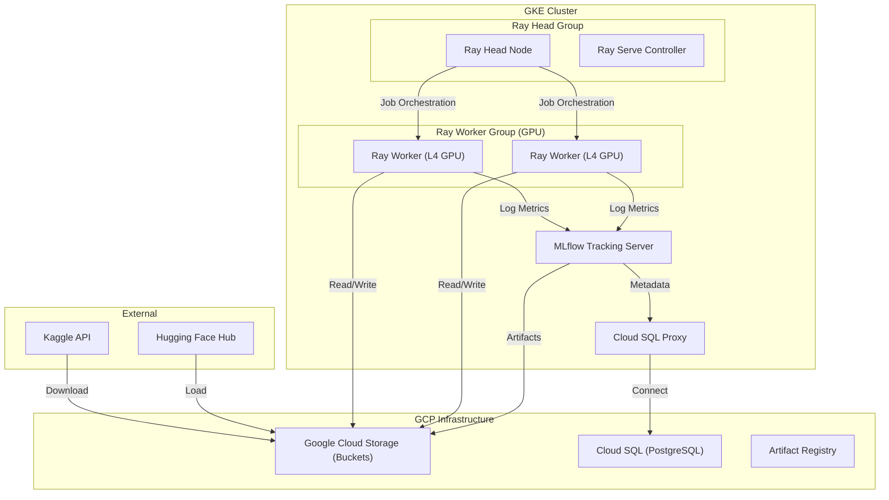

# System Architecture

The GKE Ray Embedding Pipeline is designed for high-throughput, horizontally scalable text embedding generation using a hybrid orchestration model.

## Component Overview

## Scaling Model

The architecture implements a **Two-Layer Scaling Model**:

### 1. Infrastructure Layer (GKE Cluster Autoscaler)
GKE monitors the resource requests in the cluster. When Ray attempts to spin up more worker pods than the current nodes can accommodate, GKE automatically provisions new Compute Engine instances (e.g., `g2-standard-4` spots with L4 GPUs).

### 2. Application Layer (Ray Autoscaler & Ray Serve)
- **Ray Autoscaler**: Monitors the task queue and pending actor requests. It dynamically requests more pod replicas from Kubernetes when load increases.
- **Ray Serve**: Manages the life cycle of the `EmbeddingModel` deployment. It uses request-based autoscaling to adjust replicas (min/max) based on real-time traffic.

## Benefits of Ray on GKE

| Feature         | GKE (Kubernetes)  | Ray                      | Benefit of Hybrid                                        |
| :-------------- | :---------------- | :----------------------- | :------------------------------------------------------- |
| **Scheduling**  | Container-level   | Task/Actor-level         | Fine-grained GPU slicing with container isolation.       |
| **Scaling**     | Node pool scaling | Logical resource scaling | Ray handles the "what" to scale; GKE handles the "how".  |
| **Portability** | Standard K8s API  | Python-native API        | Runs on any cloud with a standard Kubernetes setup.      |
| **Recovery**    | Pod restarts      | Actor/Task retries       | Multi-level fault tolerance for long-running batch jobs. |
